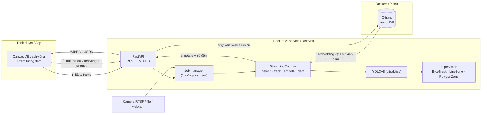
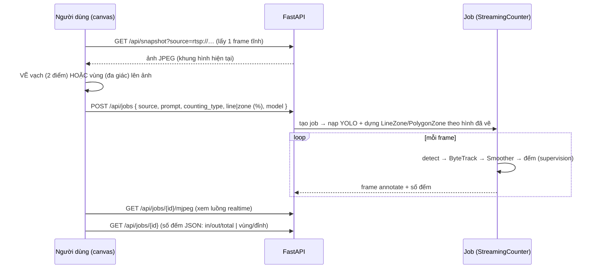

# 📐 Kế hoạch dựng AI Service (Docker) — đếm người & phương tiện

**Mục tiêu.** Đóng gói hệ thống đếm (đã test ổn: **YOLOv8 + supervision**) thành **AI service
chạy trong Docker**: FastAPI nhận request, cài sẵn Supervision + YOLO + **vector database**.
Điểm mới quan trọng: **người dùng TỰ VẼ vạch/vùng lên khung hình → vẽ xong thì AI đếm** theo
đúng hình đó.

> Không dùng LocateAnything trong service này (đã tạm gỡ). Chỉ YOLO (người/xe) + supervision
> (ByteTrack + LineZone + PolygonZone) — đúng phần đã kiểm chứng.

---

## 1. Kiến trúc tổng thể



**Thành phần**
| Khối | Vai trò | Trạng thái |
|---|---|---|
| **FastAPI** (`recognition/service/app.py`) | REST API + trang web + luồng MJPEG | ✅ đã có |
| **StreamingCounter** (`engine.py`) | detect→ByteTrack→Smoother→LineZone/PolygonZone theo từng frame | ✅ đã có (line/zone/fullscreen) |
| **FrameSource** (`camera.py`) | đọc RTSP/HTTP/file/webcam ở luồng nền, tự reconnect | ✅ đã có |
| **YOLOv8** (`detectors/ultralytics_yolo.py`) | phát hiện người/xe (recall cao: yolov8x/imgsz1280/conf0.15) | ✅ đã có |
| **Canvas vẽ vạch/vùng** | UI cho người dùng vẽ trực tiếp trên frame | 🔨 làm mới (Phase 2) |
| **Qdrant** (vector DB) | ReID cross-camera + tìm kiếm/lịch sử sự kiện | 🔨 làm mới (Phase 3) |
| **Docker/Compose** | đóng gói + chạy service | 🔨 làm mới (Phase 1) — đã có Dockerfile |

---

## 2. Luồng "VẼ → ĐẾM" (điểm mới)



**Toạ độ theo %** (0–100) nên vẽ trên ảnh hiển thị cỡ nào cũng khớp camera thật (không phụ
thuộc độ phân giải). Vẽ xong bấm "Bắt đầu đếm" → job chạy nền, đếm ngay theo vạch/vùng đó.

---

## 3. API (dự kiến — mở rộng cái đã có)

| Method | Endpoint | Ý nghĩa | TT |
|---|---|---|---|
| GET | `/` | Trang web: nhập nguồn + **canvas vẽ** + xem đếm | ✅/🔨 nâng cấp |
| GET | `/api/snapshot?source=…` | Lấy **1 frame** để vẽ vạch/vùng | 🔨 mới |
| POST | `/api/jobs` | Tạo job đếm (kèm line/zone người dùng vẽ, %) | ✅ có |
| GET | `/api/jobs` · `/api/jobs/{id}` | Liệt kê / số đếm hiện tại | ✅ có |
| GET | `/api/jobs/{id}/frame.jpg` · `/mjpeg` | Frame annotate / luồng MJPEG | ✅ có |
| POST | `/api/jobs/{id}/stop` | Dừng job | ✅ có |
| GET | `/api/search/similar` | (vector DB) tìm vật giống — ReID | 🔨 Phase 3 |
| GET | `/api/events` | (vector DB) lịch sử đếm / truy vấn | 🔨 Phase 3 |
| GET | `/healthz` | Health check cho Docker/K8s | 🔨 mới |

Body `POST /api/jobs` (giữ nguyên schema đã có, `line`/`zone` là hình người dùng vẽ):
```json
{ "source": "rtsp://…", "prompt": "person",
  "counting_type": "line", "line": [x1,y1,x2,y2],
  "counting_type_alt": "zone", "zone": [[x,y],…],
  "model": "yolo", "max_fps": 8 }
```

---

## 4. Dependencies (đã đưa vào `requirements-service.txt`)
`fastapi`, `uvicorn[standard]`, `python-multipart` · `ultralytics` (YOLO), `supervision`
(ByteTrack/LineZone/PolygonZone), `opencv-python-headless`, `numpy`, `torch` · `qdrant-client`.

## 5. Docker (Phase 1 — ĐÃ tạo file)
- **`Dockerfile`** — python3.11-slim + libGL/ffmpeg + torch (CPU mặc định, `--build-arg
  TORCH_CUDA=cu121` cho GPU) + nạp sẵn `yolov8x.pt` + `HEALTHCHECK` + chạy `run_service.py`.
- **`docker-compose.yml`** — 2 service: `api` (FastAPI) + `qdrant` (vector DB, volume bền);
  biến môi trường `YOLO_WEIGHTS/IMGSZ/CONF`, `QDRANT_URL`; sẵn khối cấu hình **GPU**.
- **`.dockerignore`** — loại notebook/video/output khỏi image.

```bash
docker compose up --build           # CPU
# GPU: sửa TORCH_CUDA=cu121 + bỏ comment khối deploy.devices trong compose, cần nvidia-container-toolkit
```

## 6. Vector database dùng làm gì? (Qdrant)
Đếm thuần **không cần** vector DB, nhưng có nó mở ra:
1. **ReID / chống đếm trùng** — lưu **embedding ngoại hình** mỗi track; vật rời khung rồi quay
   lại (hoặc sang camera khác) → so vector → nhận ra "cùng một người/xe" → không đếm 2 lần.
2. **Tìm kiếm** — "tìm người mặc áo đỏ đã đi qua lúc 9h" bằng ảnh/vector truy vấn.
3. **Lịch sử sự kiện** — lưu mỗi lần cắt vạch (thời gian, lớp, ảnh crop, vector) để thống kê/tra cứu.

Collection gợi ý: `tracks` (vector ngoại hình + payload: camera, lớp, thời gian, ảnh crop).
Embedding: dùng feature của YOLO/ByteTrack hoặc 1 model ReID nhỏ (osnet) — chốt ở Phase 3.

---

## 7. Lộ trình theo giai đoạn

| Giai đoạn | Nội dung | Kết quả |
|---|---|---|
| **P0 — Nền (đã có)** | FastAPI jobs + MJPEG + StreamingCounter (YOLO+supervision, line/zone/fullscreen) | ✅ chạy được bằng `run_service.py` |
| **P1 — Docker + deps** | `Dockerfile`, `docker-compose` (api+qdrant), requirements | ✅ file đã tạo → `docker compose up` chạy FastAPI, nhận request |
| **P2 — Vẽ vạch/vùng** | `/api/snapshot` + canvas HTML/JS vẽ line·polygon → POST → đếm; healthz | Người dùng vẽ trên khung → AI đếm ngay |
| **P3 — Vector DB** | Tích hợp Qdrant: lưu embedding/track + sự kiện; API search/ReID | Chống đếm trùng + tra cứu |
| **P4 — Vận hành** | Lưu bền số đếm, auth token, log/metrics, nhiều camera, test tích hợp | Sẵn sàng triển khai |

**Ưu tiên đề xuất:** làm **P1 → P2** trước (dựng được Docker + tính năng vẽ→đếm là giá trị
chính), rồi P3 (vector DB) khi cần ReID/tra cứu.

## 8. Rủi ro & lưu ý
- **GPU**: YOLOv8x realtime cần GPU; CPU vẫn chạy nhưng chậm → hạ `YOLO_WEIGHTS=yolov8m.pt`
  hoặc `max_fps` thấp. Docker GPU cần `nvidia-container-toolkit`.
- **RTSP** trong container: cần `ffmpeg` (đã cài) + mạng thông tới camera.
- **Nhiều camera**: mỗi job 1 luồng + 1 detector; nạp YOLO **một lần** dùng chung để tiết kiệm VRAM.
- **Vẽ vạch sai luồng** → đếm 0: đã theo % để khớp mọi độ phân giải; UI nên hiện luôn số đếm
  để người dùng chỉnh vạch cho đúng.
