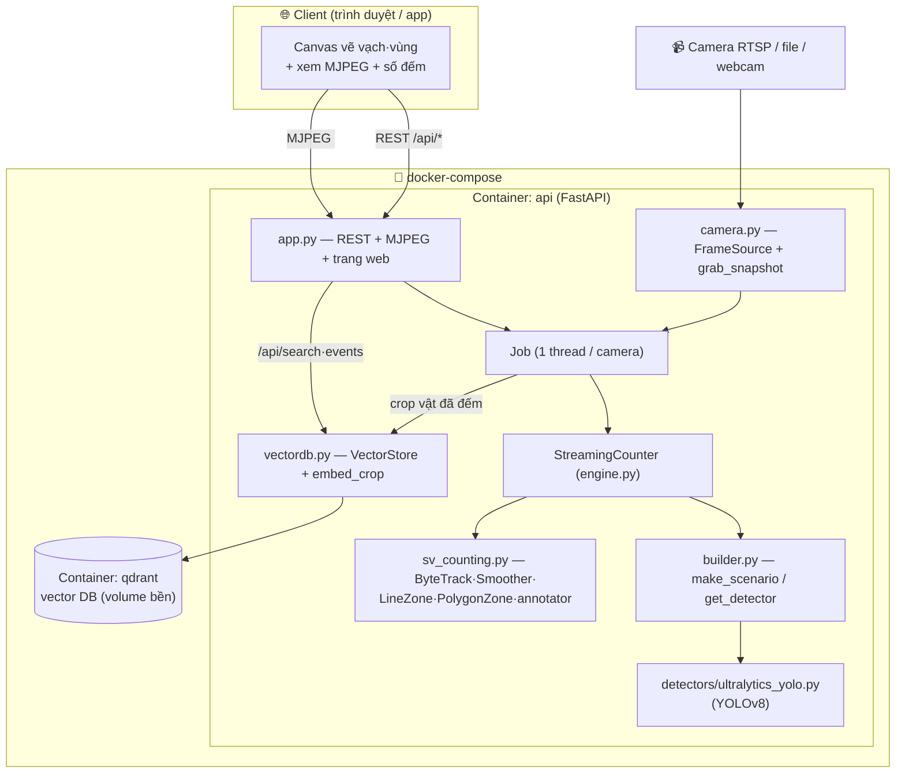
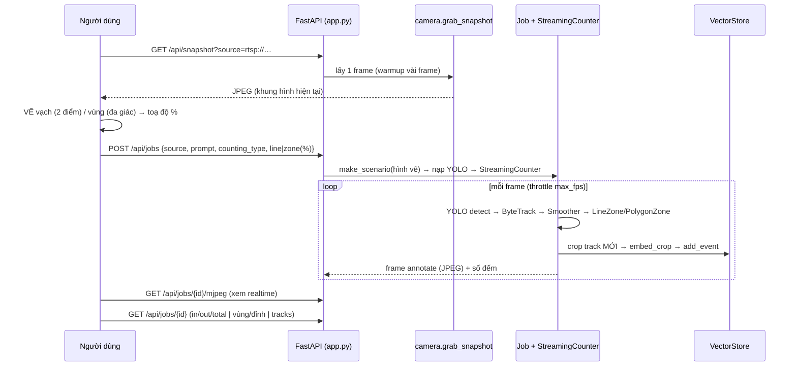

# 🏛️ Kiến trúc hệ thống — VisionOS AI Counting Service

Tài liệu kiến trúc cho hệ thống **đếm người & phương tiện** đã dựng: detect bằng **YOLOv8**,
track/đếm bằng **supervision**, phục vụ qua **FastAPI**, lưu ngoại hình vật vào **vector DB
(Qdrant)**, đóng gói bằng **Docker**. Người dùng **vẽ vạch/vùng lên khung hình → AI đếm**.

---

## 1. Tổng quan & công nghệ

| Lớp | Công nghệ | Vai trò |
|---|---|---|
| **Phát hiện** | YOLOv8 (ultralytics) | Tìm người/xe mỗi frame (recall cao: yolov8x, imgsz1280, conf0.15) |
| **Theo dõi + đếm** | supervision (Roboflow) | ByteTrack (bám vết) · DetectionsSmoother (mượt) · **LineZone/PolygonZone** (đếm) |
| **API** | FastAPI + Uvicorn | REST + luồng MJPEG + trang web canvas |
| **Vector DB** | Qdrant (fallback in-memory) | Lưu embedding ngoại hình vật → ReID / tìm kiếm / lịch sử |
| **Đóng gói** | Docker + docker-compose | 2 service: `api` + `qdrant` |

**3 kiểu đếm:** cắt **VẠCH** (vào/ra) · trong **VÙNG** (occupancy) · **TOÀN MÀN HÌNH** (mọi vật trong khung).

---

## 2. Sơ đồ thành phần & triển khai



**Vì sao 2 container:** `api` (stateless, scale được) tách khỏi `qdrant` (stateful, có volume).
Detector YOLO nạp **một lần**, dùng lại cho mọi job → tiết kiệm VRAM.

---

## 3. Luồng "VẼ → ĐẾM" (tính năng chính)



**Pipeline 1 frame** (trong `StreamingCounter.process`):
```
frame → YOLO.detect(prompt) → _to_sv (class_id ổn định)
      → ByteTrack.update → DetectionsSmoother.update
      → LineZone.trigger  (đếm vạch)  |  PolygonZone.trigger (đếm vùng)  |  len(det) (toàn khung)
      → annotate (RoundBox+Label+Trace, MÀU THEO LỚP) → JPEG
```

---

## 4. Bản đồ module (file → vai trò)

| File | Vai trò |
|---|---|
| `recognition/base.py` | Kiểu nền: `BoundingBox`, `Detection`, `DetectorResult` (thuần Python) |
| `recognition/detectors/ultralytics_yolo.py` | **YOLOv8** — detect người/xe; recall cao; env `YOLO_WEIGHTS/IMGSZ/CONF/AUGMENT` |
| `recognition/detectors/yolo_nas.py` | `COCO_ALIASES` (vehicle→car/moto/truck/bus); backend YOLO-NAS (tuỳ chọn) |
| `recognition/scenarios.py` | `CountScenario` — cấu hình 1 bài đếm (line/zone/fullscreen, vạch/vùng %) |
| `recognition/sv_counting.py` | Engine supervision: `sv_run` (cả video) + `_to_sv`/annotate + class_id ổn định |
| `recognition/service/engine.py` | **`StreamingCounter`** — đếm TỪNG frame (có trạng thái) cho camera |
| `recognition/service/camera.py` | `FrameSource` (đọc nền, reconnect) + `grab_snapshot` + `encode_jpeg` |
| `recognition/service/builder.py` | `make_scenario` (dựng từ request) + `get_detector` (cache 1 lần) |
| `recognition/service/vectordb.py` | `VectorStore` (Qdrant/in-memory) + `embed_crop` (hist màu HSV) |
| `recognition/service/app.py` | **FastAPI**: jobs, snapshot, mjpeg, healthz, events, search + trang canvas |
| `run_service.py` | Entrypoint uvicorn |
| `Dockerfile` · `docker-compose.yml` | Đóng gói api + qdrant; `scripts/docker_smoke.sh` kiểm thử |

---

## 5. Mô hình dữ liệu

**JobRequest** (POST /api/jobs): `source, prompt, counting_type(line|zone|fullscreen),
line[x1,y1,x2,y2]%, zone[[x,y]…]%, model, resolution, max_fps, confidence, record_events`.

**CountScenario**: `key, prompt, counting_type, line_start/end_pct, zone(s)_pct, resolution,
zone_anchor, in/out_label` → `build_line()/build_zones()` ra pixel theo độ phân giải xử lý.

**Sự kiện vector** (mỗi track): `vector` (256-d hist màu) + payload `{track_id, class_name,
source, counting_type, ts}` — dùng cho `/api/search/similar` (ReID) và `/api/events`.

**Số đếm trả về** (`/api/jobs/{id}`): line → `in/out/total`; zone → `in_zone/zone_peak`;
fullscreen → `in_frame/peak/total`; kèm `tracks, det_per_frame, fps, status`.

---

## 6. Đặc điểm thiết kế đã áp dụng
- **Đếm chính xác:** ByteTrack bám dai (`lost_track_buffer=120`), `minimum_consecutive_frames=1`,
  DetectionsSmoother chống nhấp nháy → ít đứt track = ít bỏ sót. stride=1 khi đếm.
- **Ít bỏ sót người/xe:** YOLOv8x + imgsz1280 + conf0.15 + max_det1000 (env chỉnh được).
- **Màu theo LỚP:** `ColorLookup.CLASS` + class_id ổn định → car/truck/bus mỗi loại 1 màu.
- **Chịu lỗi:** vector DB lỗi/không có → tự về in-memory, KHÔNG làm hỏng việc đếm; annotator
  lỗi API → rơi về vẽ cv2; FrameSource tự reconnect.
- **Toạ độ %:** vạch/vùng độc lập độ phân giải camera.

---

## 7. Điểm mở rộng (P4 — vận hành)
| Hạng mục | Hiện tại | Nâng cấp đề xuất |
|---|---|---|
| Embedding ReID | Histogram màu HSV (nhẹ) | Model ReID thật (OSNet) cho chính xác hơn |
| Lưu số đếm | Trong RAM (theo job) | Ghi DB bền (Postgres/TimescaleDB) + dashboard |
| Bảo mật | Không | API token / OAuth, HTTPS |
| Nhiều camera | Mỗi job 1 thread | Hàng đợi + worker pool; tách detector service |
| Quan sát | log stdout | Prometheus metrics + healthz (đã có) |
| GPU | ARG `TORCH_CUDA=cu121` | K8s + nvidia device plugin |

---

## 8. Kiểm chứng
- **166 unit test pass** (parsing, scenarios, counting, sv_counting, service, vectordb, snapshot,
  detectors, evaluation). API test dùng `importorskip` (chạy khi có fastapi).
- Đã kiểm chứng logic không cần GPU: pipeline detect→track→đếm (motion proxy), 3 kiểu đếm,
  màu theo lớp, vector DB (đỏ↔đỏ gần, đỏ↔xanh xa), snapshot.
- **Cần chạy thật (GPU/Docker):** `docker compose up --build` + `bash scripts/docker_smoke.sh`.

> Xem thêm: kế hoạch xây dựng theo giai đoạn tại [`docs/AI_SERVICE_PLAN.md`](AI_SERVICE_PLAN.md),
> hướng dẫn chạy tại [`SERVICE.md`](../SERVICE.md).
