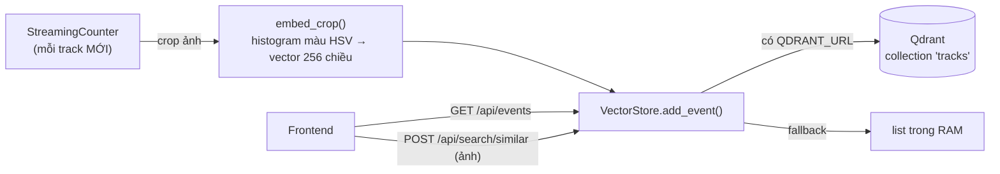

# 🧭 Kế hoạch triển khai Vector Database (Qdrant) cho AI Counting Service

Tài liệu này giải thích **vector database trong hệ thống đếm dùng để làm gì**, phần
nào đã dựng xong, phần nào còn yếu, và lộ trình đưa nó từ mức demo lên mức chạy
thật. Viết cho cả người làm AI lẫn dev backend/frontend cùng đọc, nên phần khái
niệm được nói kỹ trước khi vào chi tiết kỹ thuật.

Bản kế hoạch bám theo **code hiện có trên `main`** (`recognition/service/vectordb.py`
và các endpoint trong `app.py`), không phải mô tả lý thuyết.

---

## 1. Vector database để làm gì ở đây?

Phần đếm (YOLO + supervision) tự nó **không cần** vector database. Vạch/vùng, ByteTrack
và LineZone đã cho ra số đếm đúng. Vậy tại sao vẫn cắm thêm Qdrant?

Vì đếm chỉ trả lời câu "bao nhiêu", còn khách hàng thường hỏi thêm ba câu mà chỉ số
đếm không trả lời được:

**Có phải cùng một người/xe không?** Một người bước ra khỏi khung rồi quay lại, hoặc
đi từ camera hành lang sang camera cửa chính. ByteTrack sẽ cấp cho họ một `track_id`
mới ở mỗi lần, nên nếu chỉ cộng track thì bị đếm trùng. Muốn biết "người vừa xuất
hiện ở camera B có phải người đã đi qua camera A lúc nãy không", ta cần so **ngoại
hình**, và đây chính là việc vector database làm tốt. Mỗi vật được mã hoá thành một
**vector đặc trưng** (embedding); hai ảnh của cùng một người cho hai vector gần nhau,
hai người khác nhau cho vector xa nhau. Bài toán "có phải cùng một đối tượng" quy về
đo khoảng cách giữa các vector — thứ Qdrant tìm trong mili-giây kể cả khi đã lưu hàng
triệu điểm.

**Tra cứu lại một đối tượng.** Bảo vệ có tấm ảnh một người và muốn biết người đó từng
đi qua những camera nào, lúc mấy giờ. Thay vì tua lại toàn bộ video, ta mã hoá ảnh
truy vấn thành vector rồi hỏi Qdrant "cho tôi các vật giống nhất". Đây là chức năng
**tìm kiếm theo ngoại hình** (ReID), và nó đã có sẵn ở dạng demo qua
`POST /api/search/similar`.

**Lịch sử sự kiện.** Mỗi lần một vật mới được đếm, hệ thống lưu lại một bản ghi: lớp
(người/xe), camera nào, lúc nào, kèm ảnh cắt và một đoạn video ngắn. Frontend đọc dòng
sự kiện này để hiện "bảng tin" các đối tượng vừa đi qua, có ảnh thumbnail bấm vào xem
được. Phần này cũng đã chạy, qua `GET /api/events`.

Ba nhu cầu trên chia sẻ chung một hạ tầng: lưu vector + payload, rồi truy vấn theo độ
giống hoặc theo thời gian. Qdrant là chỗ giữ và tra vector đó.

---

## 2. Hiện trạng — đã dựng được gì

Kho vector nằm gọn trong `recognition/service/vectordb.py`, thiết kế để **service vẫn
chạy dù không có Qdrant**: nếu không kết nối được thì tự rơi về một danh sách trong RAM
(in-memory), phần đếm không bao giờ phụ thuộc vào vector DB.



Những gì đã có:

| Thành phần | Cài đặt hiện tại |
|---|---|
| **Kho lưu** | Qdrant (Docker service `qdrant/qdrant:latest`, cổng 6333, volume bền `qdrant_data`); fallback in-memory khi không có `QDRANT_URL` hoặc kết nối hỏng |
| **Kết nối** | `VectorStore` đọc env `QDRANT_URL` (compose đặt `http://qdrant:6333`), timeout 5s, tự tạo collection `tracks` nếu chưa có |
| **Embedding** | `embed_crop`: đổi ảnh crop sang HSV, tính **histogram màu** 16×16 bin (256 chiều), chuẩn hoá L2 |
| **Độ đo** | Cosine similarity |
| **Ghi sự kiện** | Mỗi `track_id` mới lưu **một** điểm; payload gồm ảnh crop + ảnh toàn cảnh (base64) + link video clip ~2 giây |
| **API** | `GET /api/vectordb` (trạng thái), `GET /api/events?limit&source` (dòng sự kiện, lọc theo camera), `POST /api/search/similar` (tra ảnh → ReID) |

Payload một sự kiện đang lưu như sau:

```json
{
  "track_id": 42,
  "class_name": "person",
  "source": "/data/hall.mp4",
  "counting_type": "line",
  "ts": 1733472000.5,
  "image_base64": "data:image/jpeg;base64,…",       // ảnh cắt của vật (q70)
  "full_frame_base64": "data:image/jpeg;base64,…",  // frame toàn cảnh (resize 640, q60)
  "video_url": "/api/videos/event_1733472000123.mp4"
}
```

Nói thẳng về mức độ hoàn thiện: đây là bản **demo chạy được**, không phải bản
production. Nó chứng minh luồng "đếm → lưu ngoại hình → tra cứu" thông suốt, nhưng
chất lượng nhận dạng và cách lưu trữ còn nhiều chỗ phải sửa trước khi tin được số liệu.
Phần 4 và 5 nói rõ từng điểm.

---

## 3. Kiến trúc triển khai

Hai container chạy cạnh nhau trong cùng `docker-compose.yml`:

```
┌─────────────────┐  QDRANT_URL=http://qdrant:6333   ┌──────────────────┐
│  api (FastAPI)  │ ───────────────────────────────► │  qdrant          │
│  YOLO+sv+vectordb│ ◄─────────── cosine search ───── │  :6333           │
└─────────────────┘                                   │  vol qdrant_data │
                                                       └──────────────────┘
```

Điểm cần nhớ khi deploy:

- **Mạng nội bộ Docker.** `api` gọi Qdrant qua tên service `qdrant`, không phải
  `localhost`. Đổi `QDRANT_URL` khi tách Qdrant ra máy/khối riêng.
- **Dữ liệu bền nằm ở volume `qdrant_data`.** Xoá container không mất dữ liệu; `docker
  compose down -v` (kèm `-v`) mới xoá. Sao lưu chính là sao lưu volume này (xem phần 7).
- **Fallback in-memory chỉ để service không chết.** Khi rơi về RAM, dữ liệu mất khi
  restart và không chia sẻ giữa nhiều tiến trình. Môi trường thật bắt buộc trỏ tới một
  Qdrant thật, và nên có health check để không âm thầm chạy ở chế độ RAM.
- **Collection tạo tự động** lúc `VectorStore` khởi tạo, kích thước vector cố định 256,
  distance cosine. Đổi embedding (phần 6) là đổi luôn số chiều, nên phải tạo lại
  collection, không dùng chung với dữ liệu cũ được.

---

## 4. Mô hình dữ liệu

Một collection duy nhất tên `tracks`. Mỗi điểm = một lần một vật mới được đếm.

| Trường | Kiểu | Ghi chú |
|---|---|---|
| `id` (point id) | int tăng dần | Sinh từ bộ đếm trong tiến trình (`self._n`), **bắt đầu lại từ 0 mỗi lần restart** — đây là mầm lỗi, xem 5.2 |
| vector | float[256] | Histogram màu HSV, L2-norm |
| `track_id` | int | Id do ByteTrack cấp trong một phiên job |
| `class_name` | str | person / car / truck / bus / motorcycle |
| `source` | str | Nguồn camera, dùng để lọc theo từng camera |
| `counting_type` | str | line / zone / fullscreen |
| `ts` | float | Epoch giây, lúc ghi sự kiện |
| `image_base64` | str | Ảnh crop, nhúng thẳng dạng data-URI |
| `full_frame_base64` | str | Ảnh toàn cảnh thu nhỏ |
| `video_url` | str | Trỏ tới clip `/api/videos/event_<ts>.mp4` |

Cách đọc dữ liệu hiện tại:

- **Theo độ giống**: `search(vector, limit)` trả top-k theo cosine.
- **Theo thời gian**: `recent(limit, source)` lấy các id gần cuối, lọc theo `source`,
  sắp xếp giảm dần theo `ts`. Cách này **giả định id liên tục và tăng đều**, nên sẽ lệch
  sau khi restart (mục 5.2).

---

## 5. Điểm yếu và rủi ro hiện tại

Đây là phần quan trọng nhất của bản kế hoạch: biết rõ chỗ nào chưa tin được thì mới ưu
tiên sửa đúng.

### 5.1. Embedding chỉ là màu → ReID yếu

`embed_crop` mã hoá **màu sắc**, không mã hoá hình dáng hay danh tính. Hai người mặc áo
đỏ giống nhau cho vector gần như trùng, còn cùng một người đi qua vùng sáng rồi vùng tối
lại cho hai vector khác nhau. Với demo "tìm vật cùng màu" thì tạm ổn; với ReID thật
(khẳng định *cùng một người*) thì độ chính xác thấp, không đủ để tự động chống đếm trùng.
Đây là hạng mục nâng cấp lớn nhất (mục 6, P2).

### 5.2. Point id trùng sau khi restart → ghi đè dữ liệu cũ

Point id lấy từ `self._n` khởi tạo bằng 0 mỗi lần tiến trình chạy lại, trong khi
`add_event` dùng `upsert`. Sau một lần restart service, sự kiện mới nhận id 0, 1, 2… và
**ghi đè** đúng các điểm cũ mang id đó trong Qdrant. Dữ liệu lịch sử bị mất âm thầm. Phải
đổi sang id không trùng (UUID, hoặc seed bộ đếm từ `count()` lúc khởi động) trước khi tin
vào lịch sử.

### 5.3. Nhồi ảnh vào payload → vector DB phình nhanh, tra chậm

Mỗi sự kiện nhét cả ảnh crop lẫn ảnh toàn cảnh dưới dạng base64 vào payload. Một
full-frame JPEG ~640px cỡ vài chục KB, base64 còn cộng thêm 33%. Qdrant sinh ra để giữ
**vector**, không phải kho ảnh; để payload nặng như vậy khiến file storage phình theo số
sự kiện, thao tác `retrieve`/`scroll` chậm dần, và bản snapshot backup to bất thường.
Ảnh và video nên nằm ở kho tĩnh (thư mục mount, hoặc MinIO/S3), payload chỉ giữ **đường
dẫn**.

### 5.4. Chưa thật sự chống đếm trùng

Sự kiện được ghi, nhưng vòng đếm **không** hỏi lại vector DB để hợp nhất các track của
cùng một vật. Chức năng ReID mới dừng ở mức người dùng chủ động upload ảnh đi tìm. Muốn
"chống đếm trùng" đúng nghĩa, phải nối bước search vào lúc một track mới xuất hiện và
quyết định có phải vật đã thấy hay không (mục 6, P3).

### 5.5. Chưa index payload, chưa có hạn lưu

Lọc theo `source`/`class_name`/thời gian hiện làm ở phía client sau khi kéo dữ liệu về.
Ở quy mô nhiều camera chạy liên tục, cần **payload index** trong Qdrant và truy vấn có
`Filter`, nếu không mỗi lần đọc sự kiện sẽ quét tuyến tính. Dữ liệu cũng chưa có TTL nên
lớn vô hạn theo thời gian.

Tóm gọn mức độ ưu tiên:

| Vấn đề | Ảnh hưởng | Độ ưu tiên |
|---|---|---|
| 5.2 id ghi đè | Mất lịch sử sau restart | 🔴 Cao |
| 5.3 payload nặng | DB phình, chậm, backup to | 🔴 Cao |
| 5.1 embedding yếu | ReID/tra cứu sai nhiều | 🟠 Trung bình–cao |
| 5.4 chưa auto-dedup | Vẫn đếm trùng cross-camera | 🟠 Trung bình |
| 5.5 chưa index/TTL | Chậm và phình khi scale | 🟡 Trung bình |

---

## 6. Lộ trình nâng cấp theo giai đoạn

Bốn phase, làm tuần tự. Mỗi phase kèm việc cụ thể và tiêu chí nghiệm thu để biết khi nào
xong.

### P1 — Ổn định dữ liệu (nền tảng, làm trước)

Mục tiêu: dữ liệu ghi vào là tin được và không phình.

- Đổi point id sang **UUID** (hoặc seed `self._n` từ `count()` lúc khởi động) để hết ghi
  đè.
- Đưa ảnh crop, full-frame, video ra **kho tĩnh** (mount `/data/events/…` hoặc MinIO);
  payload chỉ giữ URL. Bỏ base64 khỏi vector DB.
- Thêm **payload index** cho `source`, `class_name`, `ts`.
- `recent()` chuyển sang truy vấn theo `ts` có `Filter`, bỏ giả định id liên tục.

*Nghiệm thu:* restart service không mất lịch sử; dung lượng một điểm còn ~vài KB; đọc
`/api/events?source=…` lọc đúng ở phía Qdrant.

### P2 — Embedding thật (nâng chất lượng ReID)

Mục tiêu: vector phản ánh *danh tính*, không chỉ màu.

- Thay `embed_crop` bằng một model ReID nhỏ: **OSNet** (torchreid) cho người,
  đặc trưng xe riêng nếu cần phân biệt phương tiện.
- Chuẩn hoá kích thước vector mới (thường 512 chiều), tạo lại collection, giữ nguyên
  interface `embed_crop` để phần còn lại không phải sửa.
- Đo lại độ chính xác trên vài cặp video có nhãn (cùng người qua 2 camera) để có con số
  Precision/Recall của ReID, thay vì tin cảm tính.

*Nghiệm thu:* cùng một người ở hai camera cho cosine cao rõ rệt so với người khác; có
bảng số đo trước/sau khi đổi embedding.

### P3 — Tự động chống đếm trùng (ReID trong vòng đếm)

Mục tiêu: một vật đi qua nhiều lần / nhiều camera chỉ tính một lần.

- Khi một `track_id` mới xuất hiện, search vector của nó trong cửa sổ thời gian gần và
  trong nhóm camera liên quan.
- Nếu có điểm giống vượt ngưỡng (cosine + khoảng thời gian hợp lý + camera lân cận) thì
  gán về **định danh toàn cục** đã có thay vì tạo mới.
- Số đếm "unique toàn hệ thống" tính theo định danh toàn cục, tách khỏi số đếm thô từng
  camera.

*Nghiệm thu:* kịch bản một người đi vòng qua 2–3 camera cho ra đúng 1 unique, trong khi
số cắt vạch từng camera vẫn giữ nguyên.

### P4 — Vận hành và mở rộng

Mục tiêu: chạy nhiều camera, dài ngày, an toàn.

- **Hạn lưu (TTL)** hoặc job dọn định kỳ để DB không lớn vô hạn.
- **Backup/snapshot** Qdrant theo lịch (mục 7).
- **Quantization** vector (scalar/product) khi số điểm lớn để tiết kiệm RAM.
- **Bảo mật**: đặt Qdrant sau mạng nội bộ, bật API key nếu expose; service gắn token.
- Cân nhắc tách vector theo **nhiều collection** hoặc shard khi vượt ngưỡng phần cứng.

*Nghiệm thu:* chạy liên tục nhiều ngày với nhiều camera mà RAM/disk ổn định, có snapshot
khôi phục được.

---

## 7. Vận hành

**Sao lưu.** Dữ liệu nằm ở volume `qdrant_data`. Hai cách:

- Snapshot của Qdrant: `POST /collections/tracks/snapshots`, rồi copy file snapshot ra
  ngoài. Khôi phục bằng cách nạp lại snapshot.
- Sao lưu nguội: dừng container rồi backup thẳng thư mục volume.

**Ước lượng tài nguyên.** Với embedding 256–512 chiều, mỗi vector chỉ ~1–2 KB. Phần
ngốn dung lượng thật sự là **payload ảnh** (mục 5.3), nên chuyển ảnh ra kho tĩnh là cách
giảm tải rõ nhất. RAM Qdrant tỉ lệ với số điểm × số chiều; khi tới hàng triệu điểm thì
bật quantization.

**Giám sát.** Theo dõi `GET /api/vectordb` (`backend` phải là `qdrant`, không được âm
thầm rơi về `memory`) và số `events`. Cảnh báo khi backend tụt về memory, vì đó là dấu
hiệu Qdrant chết hoặc sai `QDRANT_URL`.

---

## 8. Những quyết định cần chốt với team

Trước khi làm P2–P3, cần thống nhất mấy điểm sau vì chúng ảnh hưởng tới thiết kế:

1. **ReID tới đâu?** Chỉ trong một camera (chống đếm trùng khi vật quay lại), hay xuyên
   nhiều camera (bài toán khó hơn nhiều, cần đồng bộ thời gian và hiểu bố trí camera)?
2. **Ảnh/video lưu ở đâu?** Thư mục mount đơn giản, hay MinIO/S3 để scale và chia sẻ
   giữa nhiều node?
3. **Giữ lịch sử bao lâu?** Quyết định TTL để tính dung lượng.
4. **Người và xe chung hay tách embedding?** ReID người và ReID xe dùng đặc trưng khác
   nhau; nếu cần cả hai thì nên tách collection.

Chốt được bốn điểm này thì P1 có thể bắt tay ngay, P2 trở đi triển khai theo hướng đã rõ.
